# AI Hive — Architecture Design Document

**Version:** 0.1.0-draft
**Date:** 2026-04-08
**Author:** Nino Chavez
**Status:** RFC (Request for Comments)

---

## 1. Problem Statement

Modern software development increasingly involves multiple humans working alongside AI coding agents. Current tooling assumes a 1:1 relationship — one human, one agent, one session. This breaks down when a team of developers, each with their own agent, needs to collaborate on a single codebase without:

- Agents duplicating or contradicting each other's work
- Merge conflicts from parallel, uncoordinated edits
- Context fragmentation across sessions and machines
- Loss of architectural decisions between sessions

AI Hive is a coordination layer that turns a group of independent human-agent pairs into a unified development team with shared memory, task ownership, and conflict-free parallel execution.

---

## 2. Design Principles

1. **Repository as source of truth.** The Git repo is the canonical state. All coordination artifacts live in the repo or reference it directly.
2. **Infrastructure-light.** A single Supabase project provides auth, database, realtime, and edge functions. No Redis, no Kafka, no custom servers at MVP.
3. **Agent-framework agnostic.** Any agent that can read files and call an MCP server can participate. No lock-in to Claude Code, Cursor, Copilot, or any specific tool.
4. **Human-in-the-loop by default.** Agents propose; humans approve. The system makes it easy to supervise, not easy to ignore.
5. **Graceful degradation.** If the coordination layer goes down, developers fall back to normal Git workflows. Nothing is lost.

---

## 3. System Overview

```
┌─────────────────────────────────────────────────────────────────────┐
│                         AI HIVE SYSTEM                              │
│                                                                     │
│  ┌───────────┐  ┌───────────┐  ┌───────────┐                       │
│  │ Machine A │  │ Machine B │  │ Machine C │    ... N participants  │
│  │           │  │           │  │           │                        │
│  │ Human +   │  │ Human +   │  │ Human +   │                        │
│  │ Agent     │  │ Agent     │  │ Agent     │                        │
│  └─────┬─────┘  └─────┬─────┘  └─────┬─────┘                       │
│        │              │              │                              │
│        └──────────────┼──────────────┘                              │
│                       │                                             │
│              ┌────────▼────────┐                                    │
│              │   MCP Server    │  Streamable HTTP                   │
│              │  (Shared Tools) │                                    │
│              └────────┬────────┘                                    │
│                       │                                             │
│              ┌────────▼────────┐                                    │
│              │    Supabase     │  Blackboard State                  │
│              │  (Shared Brain) │  Realtime Sync                     │
│              └─────────────────┘                                    │
│                                                                     │
│              ┌─────────────────┐                                    │
│              │   Git Repo      │  Worktrees + Constitution          │
│              │ (Source of Truth)│  decisions.md (append-only)        │
│              └─────────────────┘                                    │
└─────────────────────────────────────────────────────────────────────┘
```

---

## 4. Architecture Diagrams

### 4.1 High-Level Component Architecture

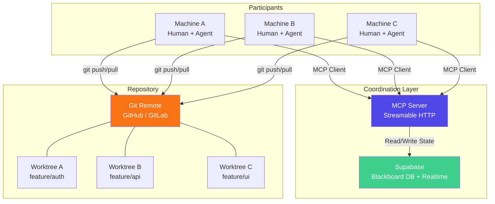

### 4.2 Blackboard Architecture — State Flow

The blackboard is the central shared state. Agents don't talk to each other — they read from and write to the blackboard. Supabase Realtime pushes changes to all subscribers.

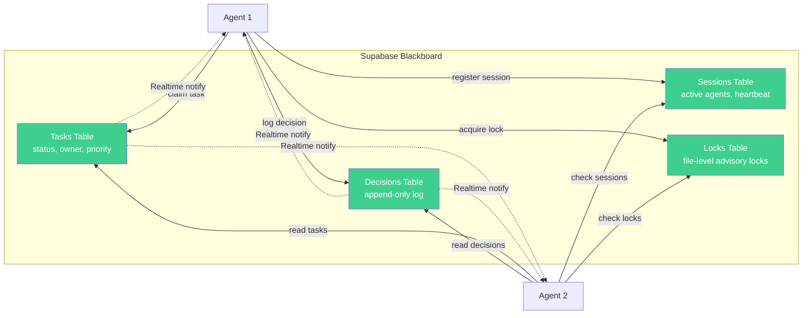

### 4.3 Task Lifecycle — State Machine

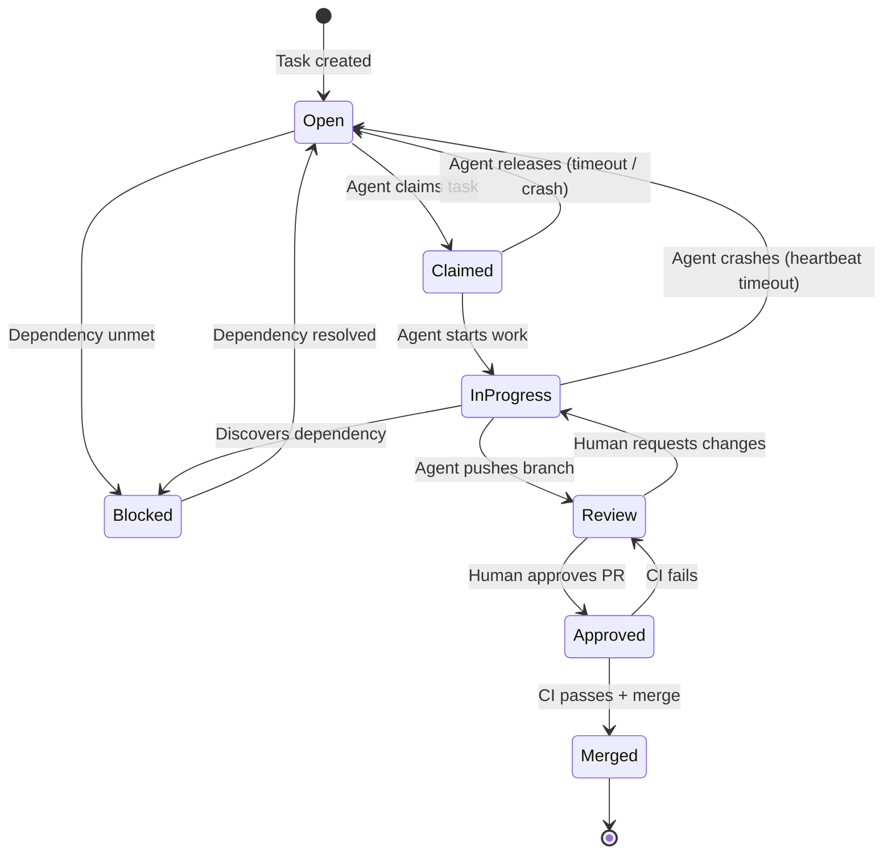

### 4.4 Parallel Execution with Git Worktrees

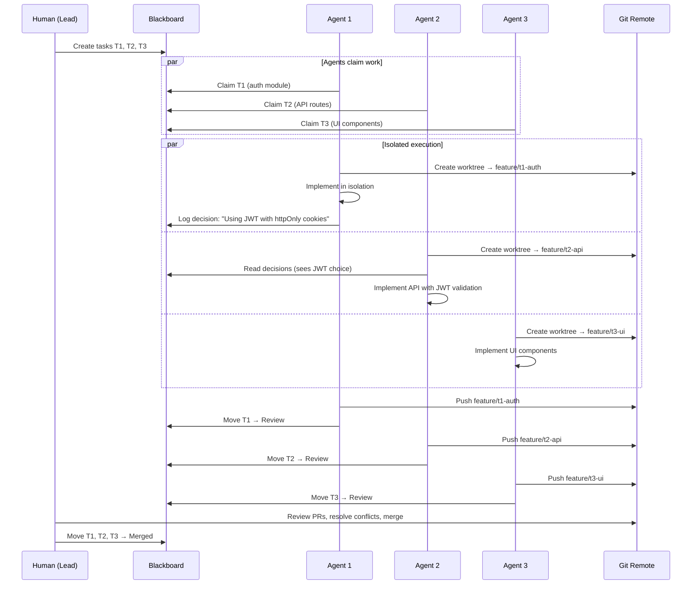

### 4.5 MCP Server — Tool Topology

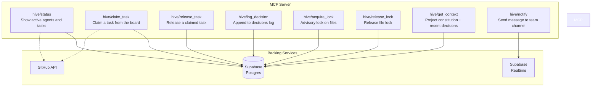

### 4.6 Session Lifecycle and Heartbeat

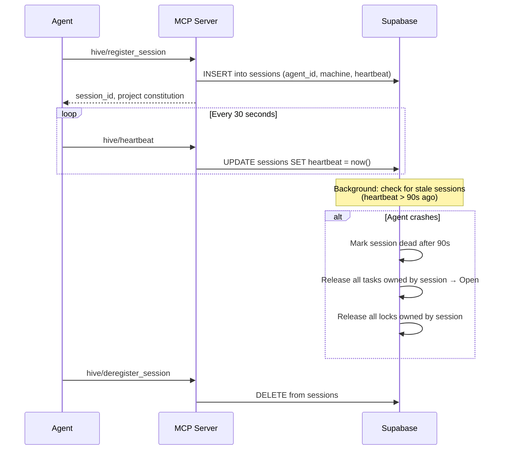

---

## 5. Data Model

### 5.1 Entity Relationship Diagram

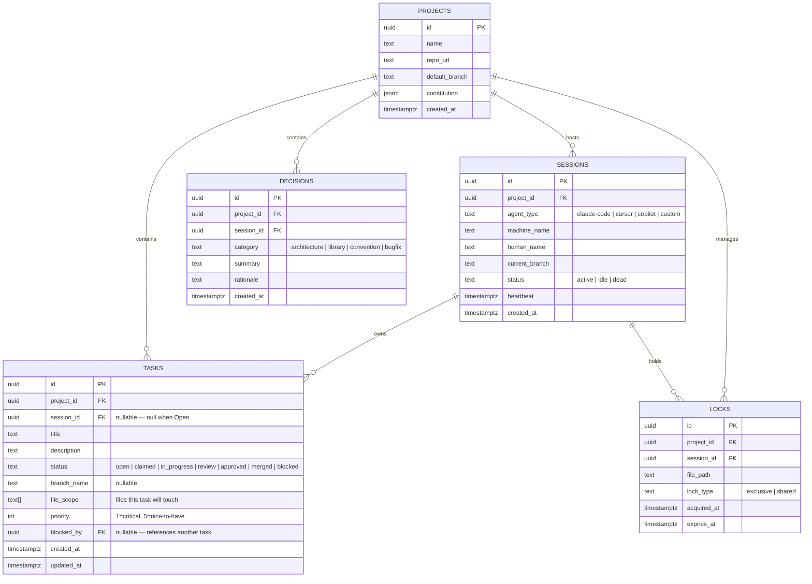

### 5.2 Key Indexes

| Table | Index | Purpose |
|-------|-------|---------|
| `tasks` | `(project_id, status)` | Fast lookup of claimable tasks |
| `tasks` | `(session_id) WHERE status IN ('claimed', 'in_progress')` | Find tasks owned by a crashing session |
| `sessions` | `(project_id, status)` | List active participants |
| `sessions` | `(heartbeat) WHERE status = 'active'` | Stale session detection |
| `locks` | `(project_id, file_path)` | Conflict check before claiming |
| `decisions` | `(project_id, created_at DESC)` | Recent decisions feed |

---

## 6. Component Details

### 6.1 MCP Server

**Runtime:** Node.js on Vercel Functions (Fluid Compute)
**Protocol:** Streamable HTTP (stateless, scalable)
**Auth:** Supabase JWT — each participant authenticates via Supabase Auth; the MCP server validates the JWT on every request.

#### Tool Definitions

| Tool | Parameters | Returns | Side Effects |
|------|-----------|---------|-------------|
| `hive/status` | `project_id` | Active sessions, task summary, recent decisions | None |
| `hive/claim_task` | `project_id, task_id` | Task details + suggested branch name | Sets task.status → claimed, task.session_id |
| `hive/release_task` | `task_id` | Confirmation | Sets task.status → open, clears session_id |
| `hive/update_task` | `task_id, status, branch_name?` | Updated task | Updates task record |
| `hive/log_decision` | `project_id, category, summary, rationale` | Decision record | Appends to decisions table |
| `hive/acquire_lock` | `project_id, file_paths[], lock_type` | Lock IDs or conflict error | Inserts lock records |
| `hive/release_lock` | `lock_ids[]` | Confirmation | Deletes lock records |
| `hive/get_context` | `project_id` | Constitution + last 20 decisions + active locks | None |
| `hive/register_session` | `project_id, agent_type, machine_name, human_name` | Session ID + full project context | Inserts session |
| `hive/heartbeat` | `session_id` | Ack | Updates heartbeat timestamp |
| `hive/notify` | `project_id, message, severity` | Delivery confirmation | Broadcasts via Supabase Realtime |
| `hive/fit_check` | `project_id, description` | Matching decisions, overlapping tasks, relevant files | Searches for existing implementations; auto-runs on task creation |
| `hive/publish_contract` | `project_id, contract_name, schema` | Contract record | Publishes a typed interface for cross-department consumption |
| `hive/get_contracts` | `project_id` | All active contracts | None |

### 6.2 Supabase Configuration

**Tables:** `projects`, `tasks`, `decisions`, `sessions`, `locks` (see data model above)

**Row Level Security:**
- All tables scoped to `project_id`
- Participants can only read/write within projects they belong to
- Session writes restricted to the owning agent's auth token
- Decisions table is append-only (no UPDATE or DELETE)

**Realtime Subscriptions:**
- `tasks` — all participants subscribe to task status changes
- `decisions` — all participants subscribe to new decisions
- `sessions` — dashboard subscribes to session status changes

**Edge Function — `reap-stale-sessions`:**
- Runs on a cron (every 60 seconds)
- Finds sessions where `heartbeat < now() - interval '90 seconds'`
- Marks session as `dead`
- Releases all tasks owned by that session back to `open`
- Releases all locks held by that session

### 6.3 Repository Constitution Files

These files live in the repo root and are read by every agent at session start via `hive/get_context`.

```
repo-root/
├── CLAUDE.md          # Agent instructions (read by Claude Code natively)
├── AGENTS.md          # Role definitions, agent-specific rules
├── decisions.md       # Append-only log (also mirrored in DB)
├── .hive/
│   ├── config.yaml    # Project ID, Supabase URL, MCP endpoint
│   └── tasks.yaml     # Optional: seed tasks for new sessions
└── ...
```

**AGENTS.md** defines:
- Agent roles available (architect, implementer, tester, reviewer)
- File ownership boundaries (e.g., "Agent handling auth MUST NOT modify UI components")
- Merge rules (e.g., "All PRs require at least one human approval")
- Naming conventions for branches (`feature/t{task_id}-{slug}`)

### 6.4 Conflict Prevention Strategy

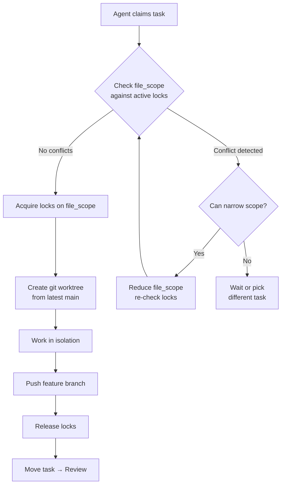

---

## 7. Deployment Architecture

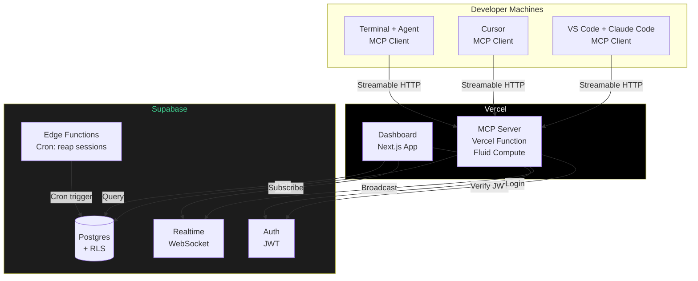

---

## 8. Competitive Landscape

As of April 2026, the multi-composer problem is being actively tackled by several emerging tools. AI Hive's differentiation is its **blackboard-first, infrastructure-light approach** — using Supabase + MCP as the coordination layer rather than requiring a dedicated orchestration runtime.

### 8.1 Direct Competitors — Multi-Agent Repo Coordination

| Tool | What it does | Relationship to AI Hive |
|------|-------------|------------------------|
| **Switchman** ([switchman.dev](https://switchman.dev), `npm i -g switchman-dev`) | File locking, task queues, merge confidence reviews. Works with Claude Code, Cursor, Codex, Windsurf, Aider. Ships as npm CLI + MCP server. | **Closest competitor.** Solves file-level conflict prevention. AI Hive goes further with shared decision memory, department contracts, fit analysis, and a persistent blackboard. Switchman could potentially be a building block *within* a hive. |
| **Microsoft Conductor** ([github.com/microsoft/conductor](https://github.com/microsoft/conductor)) | YAML-defined multi-agent workflows. Parallel execution, human-in-the-loop gates, evaluator-optimizer loops, real-time DAG visualization. Python CLI. MIT license. | **Complementary.** Conductor defines *how* agents execute workflows. AI Hive defines *how multiple humans coordinate* those workflows. A composer could use Conductor internally while the hive coordinates across composers. |
| **OpenClaw Command Center** ([github.com/jontsai/openclaw-command-center](https://github.com/jontsai/openclaw-command-center)) | Real-time dashboard for the OpenClaw agent framework. Session monitoring, token cost tracking ("LLM Fuel Gauges"), system health. Node.js, localhost. | **Reference architecture for Phase 3.** OpenClaw itself is a personal AI assistant framework (WhatsApp/Telegram/Slack), not a coding agent. But the Command Center's dashboard pattern — sessions, costs, health — is exactly what AI Hive's observability layer needs. |

### 8.2 Solo Composer Tools (Solved Problem)

| Tool | What it does | Gap for multi-composer |
|------|-------------|----------------------|
| **Claude Code** (subagents) | One human spawns parallel agents via `Agent` tool; worktree isolation built-in | Single session, single human, no cross-machine coordination |
| **Cursor** (background agents) | Multi-file agent mode within one IDE | Tied to one IDE instance, no shared state |
| **Jeremy King's Composer** | Custom orchestration — human defines work, agents execute autonomously | Solo workflow; no protocol for a second composer to join |
| **Aider** | Terminal-based AI pair programming with git integration | Single-agent, single-human |

### 8.3 Multi-Agent Frameworks (Different Abstraction Layer)

| Tool | What it does | Relationship to AI Hive |
|------|-------------|------------------------|
| **CrewAI** | Role-based agent collaboration | Agents-only; no model for human composers. Could run inside a department. |
| **AutoGen** | Conversational multi-agent loops | Agent-to-agent debate. Useful within a department for complex reasoning tasks. |
| **LangGraph** | Stateful agent graphs | Low-level primitive; could power agent logic within a hive participant. |
| **OpenHands** (formerly OpenDevin) | Autonomous AI software engineer | Single-agent. Could be one participant's agent of choice within the hive. |

### 8.4 Infrastructure Primitives (Building Blocks)

| Tool | Role in AI Hive |
|------|----------------|
| **MCP (Model Context Protocol)** | Agent-to-tool interop layer — AI Hive's MCP server is the shared tool surface |
| **Supabase Realtime** | Blackboard transport — push state changes to all participants |
| **Git worktrees** | Isolation primitive — prevents file collisions during parallel work |
| **Vercel Functions** | Hosting for MCP server and dashboard |

### 8.5 Where AI Hive Fits

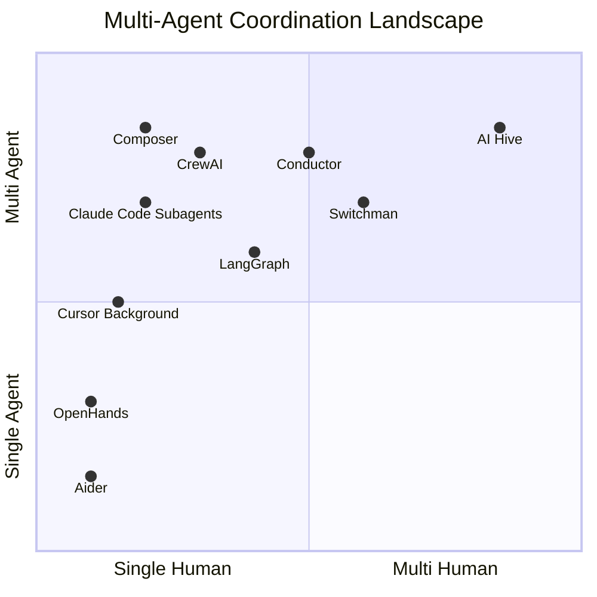

Switchman and Conductor have moved into the center of the chart — they handle multi-agent coordination and are starting to address multi-human scenarios. AI Hive's position in the upper-right is differentiated by the **blackboard + department + contract model** — not just preventing file collisions (Switchman) or defining workflows (Conductor), but maintaining shared project intelligence across human-agent teams.

### 8.6 Build vs. Integrate Decision

| Component | Build (AI Hive) | Integrate (Existing Tool) | Recommendation |
|-----------|----------------|--------------------------|----------------|
| File locking | `locks` table + MCP tools | Switchman | **Evaluate Switchman first.** If it covers file-level locking well, use it and focus AI Hive on higher-level coordination. |
| Workflow definition | AGENTS.md + task board | Conductor | **Build our own.** Conductor's YAML is agent-workflow-level; AI Hive needs project-level task coordination. Different granularity. |
| Dashboard | Next.js + Supabase Realtime | OpenClaw Command Center | **Reference, don't fork.** OpenClaw's dashboard is tied to its agent framework. Build AI Hive's dashboard but study its UX patterns. |
| Decision memory | `decisions` table + fit_check | Nothing exists | **Build.** This is novel to AI Hive. |
| Department contracts | `contracts` table + MCP tools | Nothing exists | **Build.** This is novel to AI Hive. |

---

## 9. Phase Plan

### Phase 1 — Foundation (MVP)

**Goal:** Two humans with Claude Code agents collaborate on one repo without conflicts.

| Component | Scope |
|-----------|-------|
| Supabase schema | `projects`, `tasks`, `decisions`, `sessions`, `locks` tables with RLS |
| MCP Server | Core tools: `status`, `claim_task`, `release_task`, `log_decision`, `get_context`, `register_session`, `heartbeat` |
| Repo templates | `CLAUDE.md`, `AGENTS.md`, `decisions.md`, `.hive/config.yaml` |
| Session reaper | Supabase Edge Function cron for stale session cleanup |
| Git workflow | Manual worktree creation, branch naming convention enforced by AGENTS.md |

### Phase 2 — Automation

**Goal:** Reduce manual coordination overhead.

| Component | Scope |
|-----------|-------|
| File locking | `acquire_lock` / `release_lock` tools, conflict detection |
| Auto-worktree | MCP tool that creates worktree + branch when task is claimed |
| Notifications | Supabase Realtime broadcasts to all active agents on task changes |
| CLI companion | `hive` CLI for humans to manage tasks, view status outside of agent context |

### Phase 3 — Observability

**Goal:** Real-time visibility into hive activity.

| Component | Scope |
|-----------|-------|
| Dashboard | Next.js app showing active sessions, task board, decision log |
| Activity feed | Real-time stream of all hive events |
| Metrics | Tasks completed/hour, avg time in review, conflict rate |
| Agent health | Heartbeat visualization, crash history |

### Phase 4 — Intelligence

**Goal:** The hive gets smarter over time.

| Component | Scope |
|-----------|-------|
| Semantic memory | pgvector on decisions table for "have we solved this before?" queries |
| Auto-decomposition | Agent that breaks epics into tasks with file_scope predictions |
| Conflict prediction | Analyze file_scope overlaps before claiming to suggest sequencing |
| Cross-session context | Vector search over past sessions for onboarding new agents mid-project |

---

## 10. Security Model

| Concern | Mitigation |
|---------|-----------|
| Agent impersonation | Each session authenticated via Supabase Auth JWT; MCP server validates on every call |
| Unauthorized repo access | Git SSH keys are per-machine; MCP server never touches Git directly |
| State tampering | RLS policies scope all writes to authenticated project members |
| Decision integrity | Decisions table is append-only — no UPDATE/DELETE allowed by RLS |
| Lock starvation | Locks have `expires_at`; reaper releases expired locks automatically |
| Runaway agents | Heartbeat timeout auto-releases resources; humans can kill sessions via dashboard |

---

## 11. The Multi-Composer Problem

> "For solo dev orchestrating virtual coworkers (agents), the problem is pretty much solved. But how do you organize and manage multiple solo devs doing the same thing?"

This section addresses the core unsolved problem that AI Hive targets — informed by conversations with Jeremy King (creator of Composer, a solo-dev orchestration system).

### 10.1 Solo Composer vs. Hive: The Spectrum

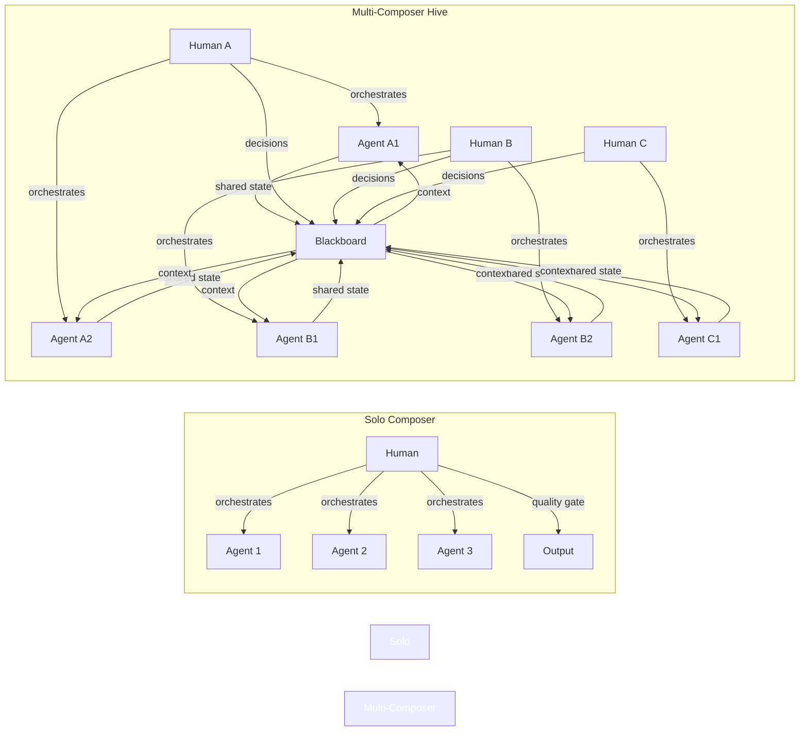

The solo composer pattern (Jeremy's model, Cursor background agents, Claude Code subagents) is solved because there's one brain making all decisions. The multi-composer problem introduces **distributed consensus** — multiple humans with potentially conflicting visions, each commanding their own agent swarm.

### 10.2 Three Coordination Models

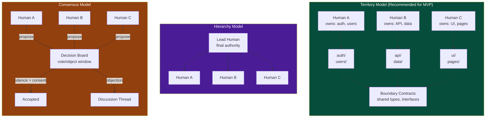

| Model | When it works | When it breaks |
|-------|--------------|----------------|
| **Territory** | Clear module boundaries, hackathon pace, 2-5 people | Shared concerns (auth touches everything), unclear ownership |
| **Hierarchy** | Established tech lead, enterprise teams, critical projects | Bottleneck on lead, lead becomes unavailable |
| **Consensus** | Research projects, design decisions, small teams with trust | Time pressure (voting is slow), deadlocks |

**AI Hive defaults to Territory with Consensus fallback.** Each human-agent pair owns a domain (enforced by file_scope and locks). Cross-domain decisions go to the blackboard with an objection window.

### 10.3 The Department Analogy

Jeremy's insight — "model orchestration like an enterprise team with departments" — maps directly to the territory model with one addition: **departments have interfaces**.

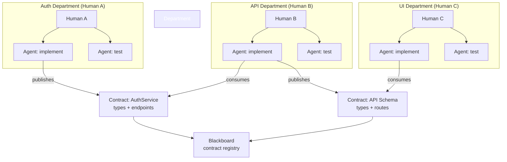

Each department:
- **Owns** a set of files/directories (enforced by locks)
- **Publishes** contracts (TypeScript interfaces, API schemas) to the blackboard
- **Consumes** contracts from other departments
- **Reports status** upward to the shared task board
- Has **one human** as the decision-maker within that department

When a contract changes, all consuming departments are notified via Supabase Realtime. The human in each affected department decides how to adapt.

### 10.4 Fit Analysis — "Is This Already Built?"

Jeremy identified a gap in his own system: nothing prevents an agent from reimplementing something that already exists. In a multi-composer hive, this risk multiplies — Human B's agent might build a utility that Human A's agent already shipped.

The hive addresses this at two levels:

**Level 1 — Passive (Constitution)**
The `decisions.md` log and `hive/get_context` tool give every agent visibility into what's been built. When an agent starts a task, it reads the full decision history first.

**Level 2 — Active (Fit Check)**
A new MCP tool:

| Tool | Parameters | Returns | Logic |
|------|-----------|---------|-------|
| `hive/fit_check` | `project_id, description` | Matching decisions, overlapping tasks, relevant file paths | Searches decisions + active/completed tasks for semantic overlap. Returns "already implemented," "in progress by [session]," or "no match" |

At MVP, fit_check is a keyword search across decisions and task titles. At Phase 4, it becomes a semantic search via pgvector. The key insight: **fit_check runs automatically when a task is created**, not just when claimed. This prevents duplicate tasks from entering the board at all.

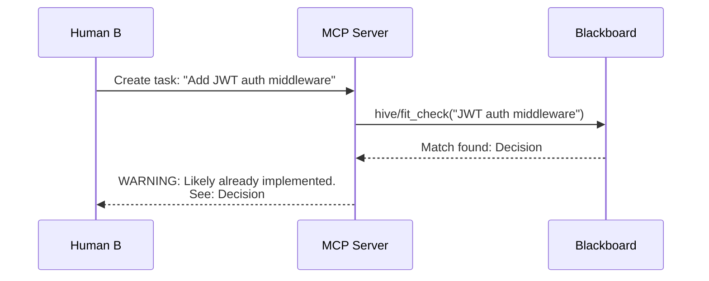

### 10.5 The Human Role Evolution

Jeremy's observation — "devs no longer create the actual product, they evolve agent configurations and work on the plumbing" — describes where this is heading. In the hive model, each human's role shifts:

| Traditional Role | Hive Role |
|-----------------|-----------|
| Write code | Define tasks, review agent output |
| Debug locally | Monitor agent sessions, intervene on failures |
| Attend standups | Read the blackboard, log decisions |
| Resolve merge conflicts | Define territory boundaries, maintain contracts |
| Maintain docs | Maintain constitution files (CLAUDE.md, AGENTS.md) |

The humans become **department leads** — they spend most of their time on requirements, ideation, and quality gates. The "plumbing" Jeremy mentioned is the constitution: tuning agent instructions, adjusting file scopes, refining decision-making rules.

---

## 12. Open Questions

1. **Task granularity:** Should the system enforce a maximum file_scope per task, or trust agents to self-regulate?
2. **Decision conflicts:** What happens when two agents log contradictory decisions simultaneously? First-write-wins? Human arbitration?
3. **Cross-repo hives:** Should a single hive span multiple repositories (e.g., frontend + backend), or one hive per repo?
4. **Agent capability discovery:** Should agents declare their capabilities (e.g., "I can write tests but not infrastructure"), and should the system use this for task matching?
5. **Offline mode:** How much should work when the Supabase connection is unavailable? Just Git, or a local blackboard that syncs later?
6. **Territory negotiation:** When module boundaries are unclear (e.g., "auth touches everything"), how do humans negotiate ownership? Pre-project planning session? Dynamic renegotiation via the blackboard?
7. **Contract enforcement:** Should the system enforce that departments only interact through published contracts (strict), or allow ad-hoc cross-department file edits with warnings (permissive)?
8. **Fit check threshold:** How aggressive should duplicate detection be? Too sensitive = false positives blocking legitimate work. Too loose = duplicate implementations.
9. **Scaling composers:** The current design assumes 2-5 human composers. At 10+, does territory still work, or does the system need hierarchy with territory underneath?
10. **Solo-to-hive transition:** Can a solo dev using their own Composer-like workflow join a hive mid-project without retooling? What's the minimum integration surface?

---

## 13. Glossary

| Term | Definition |
|------|-----------|
| **Blackboard** | Shared state store (Supabase Postgres) that agents read from and write to instead of communicating directly |
| **Constitution** | The combination of `CLAUDE.md`, `AGENTS.md`, and project config that defines rules all agents must follow |
| **Decision** | An append-only record of an architectural or implementation choice, with rationale |
| **Hive** | A single collaborative project instance — one repo, one Supabase project, one MCP server, N participants |
| **Lock** | Advisory file-level lock preventing two agents from modifying the same files simultaneously |
| **Participant** | A human-agent pair operating on one machine |
| **Session** | A single agent's active connection to the hive, tracked by heartbeat |
| **Worktree** | An isolated Git working directory allowing parallel branch development without checkout conflicts |
| **Composer** | A human who orchestrates one or more agents — the hive coordinates multiple composers |
| **Territory** | A bounded set of files/directories owned by one composer; enforced by locks and file_scope |
| **Department** | A composer + their agents, operating within a territory, publishing and consuming contracts |
| **Contract** | A typed interface (API schema, TypeScript types) published by one department for others to consume |
| **Fit Check** | Automated search for existing implementations before creating or claiming a task |
